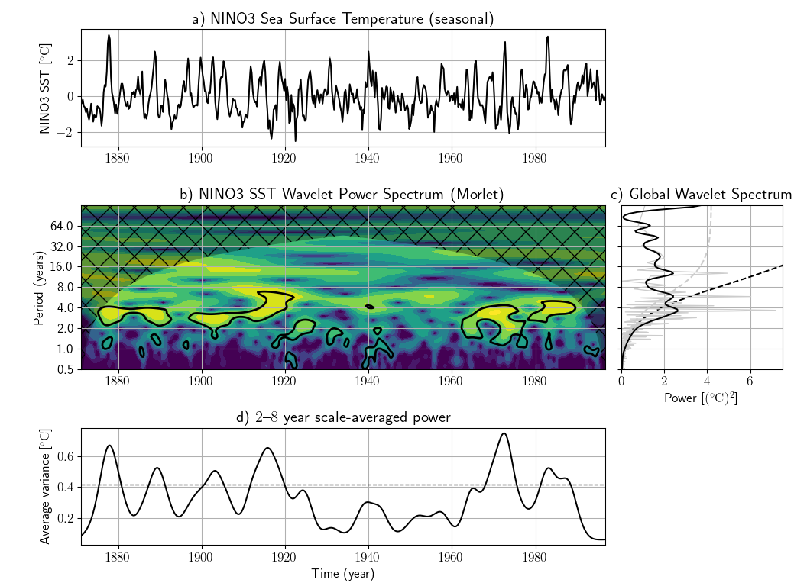

# PyCWT-mod: modular wavelet spectral analysis in Python

A modular fork of the continuous wavelet transform module for Python. It includes a
collection of routines for wavelet transform and statistical analysis via FFT
algorithm. In addition, the module also includes cross-wavelet transforms,
wavelet coherence tests and sample scripts.

* [Installation](./user-guide/installation.md)
* [Getting started](./user-guide/getting-started.md)
* [Tutrial](./tutorial/cwt.md)
* [Reference](./reference/index.md)

!!! info "How to cite"

    Sebastian Krieger, Nabil Freij, and contributors. _PyCWT-mod: modular wavelet spectral analysis in Python_. Python. 2025. <https://github.com/aptitudetechnology/pycwt-mod>.